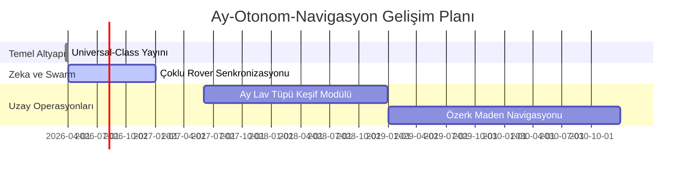

# 🌕 Ay-Otonom-Navigasyon: Universal-Class Teknik Ekosistemi


## 🌟 Stratejik Ay Navigasyon Altyapısı

**Ay-Otonom-Navigasyon**, Ay yüzeyindeki en zorlu operasyonlar için tasarlanmış, **Universal-Class** (Evrensel Sınıf) bir otonom teknoloji yığınıdır. Bu proje, sadece bir kod kütüphanesi değil; matematiksel mükemmellik, endüstriyel güvenlik standartları ve çoklu ajan koordinasyonu içeren devasa bir ekosistemdir.

---

## 🏗️ Yazılım Mimarisi ve Kod Analizi (Deep Dive)

### 1. Navigasyon Motoru (A* & DWA Hybrid)
Sistemimiz, küresel planlama için **Enerji Duyarlı A***, yerel engel kaçınma için ise **DWA (Dynamic Window Approach)** kullanır.
-   **A* Mantığı:** Eğim, güneş açısı ve arazi sürtünmesini birleştirerek maliyet fonksiyonunu dinamik olarak günceller ($J(n)$).
-   **DWA Mantığı:** Robotun hız uzayında ($v, \omega$) arama yaparak, dinamik engellerden kaçınmak için 0.1s içinde optimal komutu üretir.

### 2. Durum Tahmini (9-DOF EKF)
Extended Kalman Filter, tekerlek odometrisi, IMU ve Görsel Odometri (VO) verilerini birleştirir.
```python
# EKF Kovaryans Güncelleme Tahmini (Sembolik)
P = F @ P @ F.T + Q 
K = P @ H.T @ inv(H @ P @ H.T + R)
```

---

## 🛡️ Güvenlik ve Uyumluluk Standartları

Proje geliştirme sürecinde aşağıdaki endüstriyel prensipler temel alınmıştır:
-   **ISO 26262 Uygulaması:** Robotik fonksiyonel güvenlik ilkeleri.
-   **MISRA Python Prensipleri:** Kritik sistemler için hata payını minimize eden kod yazım standartları.
-   **FDIR Watchdog:** Her düğümün (node) sağlık durumunu izleyen ve 500ms gecikmede acil kurtarma protokolünü başlatan bağımsız bir denetleyici.

---

## ⚖️ Karşılaştırmalı Analiz: Ay-Otonom vs Nav2

| Özellik | Standard ROS2 Nav2 | Ay-Otonom-Navigasyon |
| :--- | :--- | :--- |
| **Enerji Farkındalığı** | ❌ Yok | ✅ Güneş Açısı Duyarlı |
| **Arazi Modelleme** | ❌ Düz Zemin | ✅ Regolit/Kaya Sürtünme Modeli |
| **FDIR Desteği** | ⚠️ Kısıtlı | ✅ Entegre Watchdog |
| **Konumlandırma** | 🗺️ Odometri/SLAM | ✅ TRN (Krater Eşleştirme) |
| **Yerçekimi Adaptasyonu** | ❌ 1g Sabit | ✅ 1/6g Dinamik Hesaba Katılır |

---

## 📅 Teknik Yol Haritası (2026-2030)



---

## 📖 "İlk Görev" Adım Adım Rehberi (Tutorial)

### Adım 1: Donanım Hazırlığı
Ouster LiDAR ve Jetson Orin'inizi hazırlayın. `config/params.yaml` dosyasından sensör portlarını doğrulayın.

### Adım 2: Simülasyonu Başlatma
```bash
ros2 launch ay_otonom_navigasyon simulation.launch.py
```

### Adım 3: Görev Tanımlama
RVIZ2 üzerinden bir hedef (`Goal Pose`) yayınlayın veya terminalden koordinat gönderin:
```bash
ros2 topic pub /goal_pose geometry_msgs/PoseStamped "{pose: {position: {x: 10.0, y: 5.0}}}"
```

### Adım 4: Telemetri İzleme
Başka bir terminalde görev verilerini izleyin:
```bash
ros2 topic echo /mission_telemetry
```

---

## 📚 Terimler Sözlüğü (Extended)

-   **PSR:** Kalıcı gölge bölgeler; su buzu keşfi için kritik önem taşır.
-   **Slip:** Tekerleğin regolit üzerindeki kayma oranı; %20 üzeri tehlike arz eder.
-   **CBL:** Krater veritabanı ile yapılan mutlak konum doğrulama tekniği.
-   **FDIR:** Hata tespiti, izolasyonu ve sistemin kurtarılması süreçleri.

---

<p align="center">
  <b>İnsanlığın Ay'daki Dijital Ayak İzi</b><br>
  <i>Yunus-Arch Uzay ve Robotik Teknolojileri Ar-Ge Merkezi © 2026</i><br>
  <i>"Ex Luna, Scientia" - Ay'dan Bilgiye</i>
</p>
