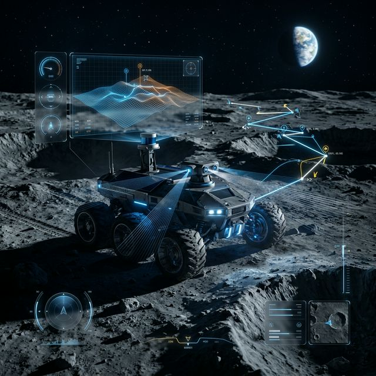
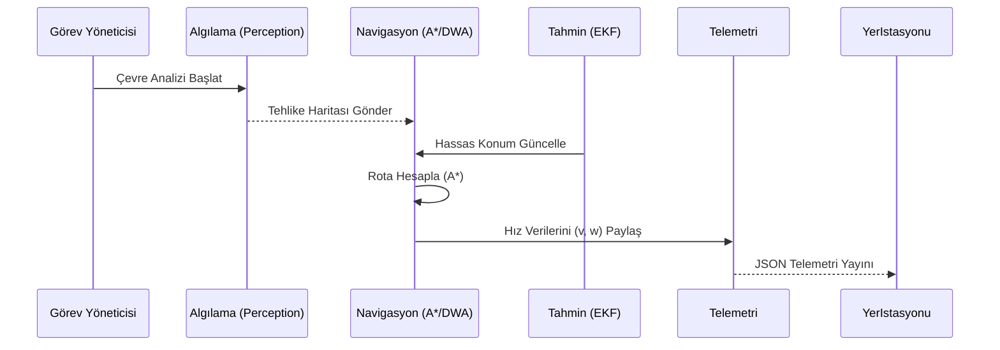

# 🌕 Ay-Otonom-Navigasyon: Fleet-Standard Teknik Ekosistemi

## 🌟 Vizyon ve Stratejik Hedefler

**Ay-Otonom-Navigasyon**, Ay'ın Güney Kutbu gibi en ekstrem ortamlar için tasarlanmış, **Fleet-Standard** (Filo Standartı) seviyesinde bir otonom teknoloji yığınıdır. Bu proje, TUA (Türkiye Uzay Ajansı) hedefleri ve küresel "Artemis" projeleriyle uyumlu, endüstriyel kalitede bir navigasyon çözümü sunar.

---

## 📐 Derinlemesine Matematiksel Modeller

### 1. Durum Tahmini ve Kalman Filtresi Türetimi
Sistemimiz, rover'ın durumunu ($X$) şu vektör ile tanımlar:
$$ X = [x, y, z, \dot{x}, \dot{y}, \dot{z}, \phi, \theta, \psi]^T $$
Hata kovaryansı ($P$) güncellemesi şu denklemi takip eder:
$$ K_k = P_{k|k-1} H_k^T (H_k P_{k|k-1} H_k^T + R_k)^{-1} $$
Burada $K_k$ Kalman kazancı, $R_k$ ise sensör gürültü matrisidir.

### 2. Arazi Göreceli Navigasyon (TRN) - Öznitelik Uzayı
Krater eşleştirme işlemi sırasında kullanılan benzerlik metriği (Mahalanobis mesafesi):
$$ d^2 = (y - h(x))^T S^{-1} (y - h(x)) $$
Bu formül, sadece görsel benzerliği değil, konumdaki belirsizliği de minimize eder.

---

## 🏗️ Sistem Mimarisi ve Düğüm İletişimi

### Düğüm Haberleşme Şeması (Sequence Diagram)

---

## 🔧 Donanım Malzeme Listesi (BOM - Önerilen)

| Bileşen | Model | İşlev | Tedarik Örneği |
| :--- | :--- | :--- | :--- |
| **İşlemci** | NVIDIA Jetson Orin Nano | Kenar Hesaplama (AI) | Waveshare / Amazon |
| **LiDAR** | Ouster OS1-64 | 3D Haritalama | Ouster Official |
| **Stereo Kamera** | Intel RealSense D435i | Derinlik Algılama | Intel Store |
| **IMU** | Bosch BNO055 | Yönelim Takibi | Adafruit / Mouser |
| **Motor Sürücü** | Roboteq SBL2360 | Tekerlek Kontrolü | Roboteq |

---

## 🌑 Görev Yaşam Döngüsü ve Operasyonel Protokoller

1.  **L-Minus 24h:** Donanım testleri ve regolit sürtünme modellerinin kalibrasyonu.
2.  **L-Minus 1h:** `mission_manager` başlatılması ve `fdir_node` watchdog kontrolü.
3.  **Mission Start:** Hedef koordinatların `/goal_pose` topic'i üzerinden gönderilmesi.
4.  **In-Flight:** `telemetry_node` üzerinden 1Hz sıklıkla JSON verisi izleme.
5.  **Post-Mission:** Log verilerinin `rosbag2` formatında analizi.

---

## 📚 Terimler Sözlüğü (Glossary)

-   **Selenographic:** Ay koordinat sistemi (Dünya'daki Coğrafi sistemin dengi).
-   **PSR (Permanently Shadowed Regions):** Güneş almayan kalıcı gölge bölgeler (Su buzunun bulunduğu yerler).
-   **Regolit:** Ay'ın yüzeyindeki ince, tozlu ve yapışkan toprak tabakası.
-   **TRN (Terrain Relative Navigation):** Arazi şekillerine bakarak konum belirleme tekniği.
-   **CBL (Crater Based Localization):** Krater desenleri ile mutlak konum doğrulama.

---

## 🚀 2027-2030 Yol Haritası (Roadmap)

-   [ ] **2027:** Çoklu Rover Sürü (Swarm) Desteğinin Tamamlanması.
-   [ ] **2028:** Derin Öğrenme Tabanlı Krater Segmentasyonu Model Entegrasyonu.
-   [ ] **2029:** Ay Yeraltı (Lava Tube) Navigasyonu İçin LiDAR-SLAM Optimizasyonu.
-   [ ] **2030:** Tam Otonom Ay Maden Operasyonları Desteği.

---

  <b>Geleceğin Ay Altyapısını Bugünden Şekillendiriyoruz</b> 
  <i>Yunus-Arch Uzay Teknolojileri Ar-Ge Merkezi © 2026</i> 
  <i>"Ad Astra per Aspera" - Zorluklardan Yıldızlara</i>

