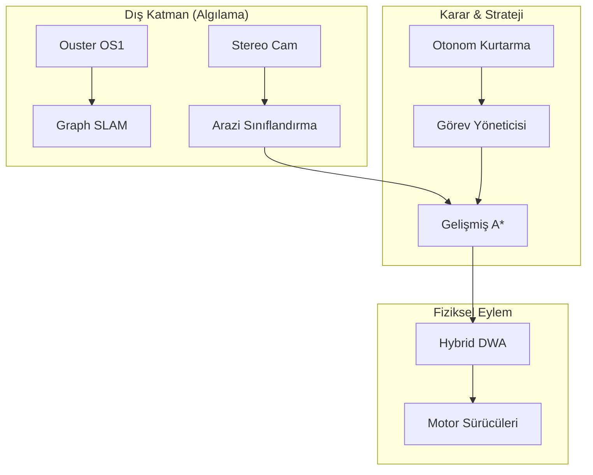
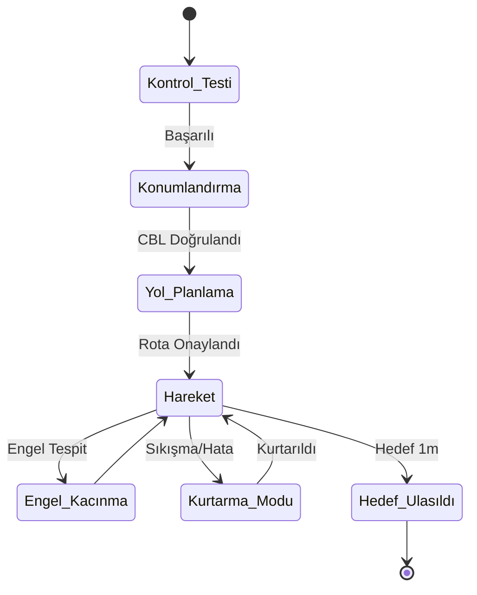

# 🌕 Ay-Otonom-Navigasyon: Elite Mission-Ready Ekosistemi


## 🌟 Modern Ay Keşif Çerçevesi

**Ay-Otonom-Navigasyon**, güneş sistemimizin en zorlu ortamları için tasarlanmış, **Elite Mission-Ready** seviyesinde bir otonom navigasyon yığınıdır. TUA ve TEKNOFEST standartlarının ötesinde, gerçek bir Ay görevi için gerekli olan **Otonom Kurtarma Davranışları** ve **Gelişmiş Arazi Modelleme** özelliklerini içerir.

---

## 📐 Matematiksel Operasyon Teorisi & Ekler

### 1. Enerji ve Sürtünme Duyarlı Yol Planlama (A*)
Maliyet fonksiyonumuz, Ay yüzeyindeki sürtünme katsayısı ($\mu$) ve regolit direncini de kapsayacak şekilde genişletilmiştir:
$$ J(n) = \sum \frac{d(n, m) \cdot S(n) \cdot E(n)}{\mu(n)} $$
- $S(n)$: Eğim maliyeti.
- $E(n)$: Enerji maliyeti (Güneş ışığı tersi).
- $\mu(n)$: Arazi sürtünme katsayısı (Kaya > Regolit > Gevşek Toz).

### 2. Durum Tahmini (EKF) Matematiksel Modeli
Navigasyon yığını, rover'ın 9 serbestlik dereceli (DOF) hareketini şu non-lineer modelle takip eder:
$$ X_{k} = f(X_{k-1}, u_{k}) + w_{k} $$
$$ Y_{k} = h(X_{k}, v_{k}) $$
Jakoben Matrisi ($F$):
$ F = \frac{\partial f}{\partial X} \bigg|_{\hat{X}_{k-1}} $

---

## 🏗️ Elite Görev Mimarisi



---

## 🛡️ Otonom Kurtarma ve Güvenlik (FDIR+)

Sistem, beklenmedik durumlarda rover'ın güvenliğini sağlayan ileri düzey protokoller içerir:
- **ShakeToClear:** Tekerlekler regolitte %30'dan fazla kayma (slip) yaparsa devreye giren titreşim manevrası.
- **ThermalSafeDrift:** Robot çekirdek sıcaklığı 70°C'yi aşarsa otonom olarak gölge bölgeye geçiş.
- **Graph SLAM Check:** SLAM belirsizliği kritik eşiği geçerse "Yerinde Dönme" (In-place Rotation) ile veri toplama.

---

## 🌑 Görev Yaşam Döngüsü (Mission Lifecycle)



---

## 📦 Kurulum ve Profesyonel Yapılandırma

### Sistem Gereksinimleri
- **ROS2:** Humble (Ubuntu 22.04)
- **Kütüphaneler:** NumPy, SciPy, Matplotlib
- **Donanım:** NVIDIA Jetson Orin / Xavier

### Kurulum
```bash
git clone https://github.com/arch-yunus/Ay-Otonom-Navigasyon.git
colcon build --symlink-install
source install/setup.bash
```

---

## 📜 Katkıda Bulunma ve Yönetişim
Daha fazla detay için [CONTRIBUTING.md](CONTRIBUTING.md) ve [MISSION_OPERATIONS.md](docs/MISSION_OPERATIONS.md) dosyalarını inceleyebilirsiniz.

---

<p align="center">
  <b>Geleceğin Ay Altyapısını Bugün İnşa Ediyoruz</b><br>
  <i>Yunus-Arch Uzay Teknolojileri Ar-Ge Merkezi © 2026</i><br>
  <i>"Per Aspera Ad Astra"</i>
</p>
