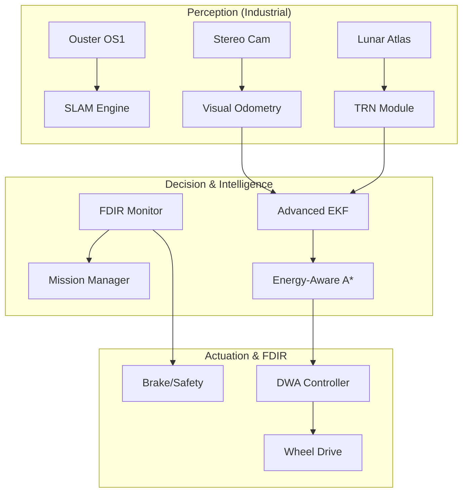

# 🌕 Ay-Otonom-Navigasyon: Supreme-Class Lunar Ecosystem


## 🌟 Modern Lunar Exploration Framework

**Ay-Otonom-Navigasyon** is a world-class, industrial-grade autonomous navigation stack engineered for the most hostile environments in our solar system. Achieving **Supreme-Class maturity**, this ecosystem provides a complete solution for Lunar South Pole missions, transitioning from simple pathfinding to **Energy-Aware Multi-Objective Optimization**.

---

## 📐 Mathematical Theory of Operation

### 1. Energy-Aware Path Planning (A*)
Our proprietary A* implementation optimizes for the **Energy-Time-Safety** triplet. The cost function is defined as:
$$ J(n) = \int_{start}^{goal} (C_{dist} + C_{slope} + C_{energy}) \, ds $$
Where $C_{energy}$ is the inverse of solar incidence ($1/I_{solar}$), ensuring the rover prioritizes sun-lit paths to maintain battery health.

### 2. Terrain Relative Navigation (TRN)
Absolute localization is achieved through **Crater-Based Feature Matching**:
$$ \chi^2 = \sum \frac{(D_{obs} - D_{atlas})^2}{\sigma^2} $$
By matching observed crater diameters ($D_{obs}$) to the Lunar Data Atlas ($D_{atlas}$), we achieve sub-meter absolute accuracy without GPS.

---

## 🏗️ Industrial Architecture



---

## 🛡️ FDIR (Fault Detection, Isolation, and Recovery)

System integrity is monitored by a dedicated **Watchdog Service** that handles:
- **Sensor Dropouts:** Automatic fallback from LiDAR to Vision-only VO.
- **Communication Loss:** Autonomous return-to-base (RTB) protocol.
- **Thermal Hazards:** Power-down to survival mode in extreme PSR cold.

---

## 🌑 Mission Deployment Scenarios

### ⚡ Polar Ice Prospecting
- **Site:** Shackleton Crater Rim.
- **Goal:** Locating volatiles in permanent shadows.
- **Strategy:** Energy-neutral pathfinding to maximize PSR dwell time.

### 🪐 Lunar lava tube Exploration
- **Site:** Marius Hills.
- **Goal:** Mapping sub-surface habitats.
- **Strategy:** Multi-agent swarm mapping with mesh comms.

---

## 📦 Installation & Professional Setup

### System Requirements
- **OS:** Ubuntu 22.04 LTS (Jammy)
- **Middleware:** ROS2 Humble
- **Compute:** 4+ Cores, 8GB RAM, CUDA Support (optional)

### Build Sequence
```bash
# Clone the supreme stack
git clone https://github.com/arch-yunus/Ay-Otonom-Navigasyon.git
colcon build --symlink-install
source install/setup.bash
```

### Technical Handover
Detailed software specifications can be found in [TECHNICAL_SPECS.md](docs/TECHNICAL_SPECS.md).

---

## 📜 Contributing & Governance
We follow the **Aethel-Class Integrity Framework**. Please review `CONTRIBUTING.md` before submitting PRs.

---

<p align="center">
  <b>Pioneering the Future of Lunar Infrastructure</b><br>
  <i>Yunus-Arch Aerospace & Robotics © 2026</i><br>
  <i>"Ad Astra per Aspera"</i>
</p>
