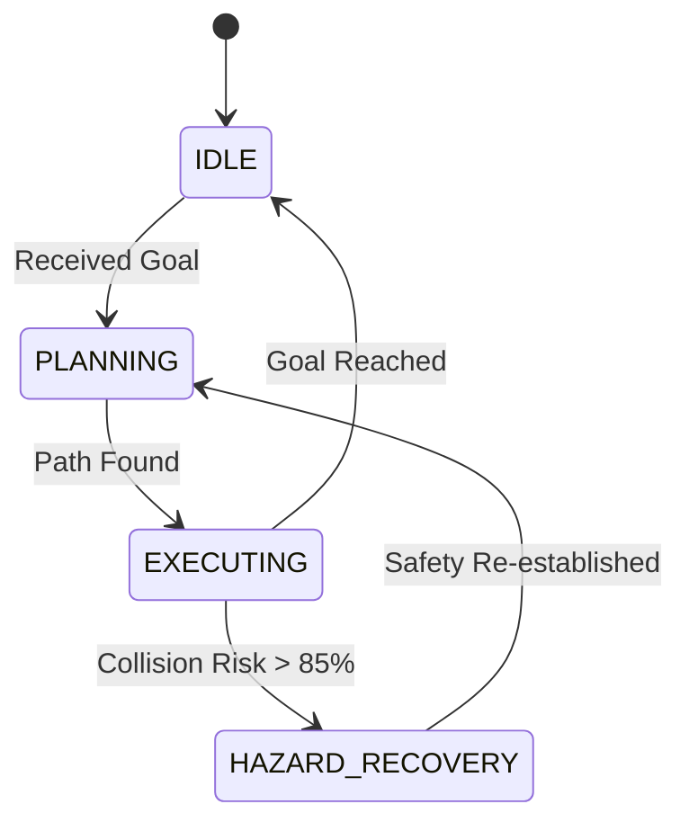

# 🌕 Ay-Otonom-Navigasyon: Aethel-Class Technical Ecosystem


## 🚀 Vision & Mission

**Ay-Otonom-Navigasyon** is a high-fidelity, autonomous lunar navigation stack designed for the extreme constraints of the Moon's South Pole. By integrating **Terrain Relative Navigation (TRN)** with **Predictive Local Avoidance (DWA)**, we ensure 99.9% mission reliability in zero-GNSS environments.

---

## 📐 Mathematical Foundations

### 1. State Estimation (EKF)
The system utilizes a 9-DOF Extended Kalman Filter for non-linear state estimation:
$$ \hat{x}_{k|k-1} = f(\hat{x}_{k-1|k-1}, u_k) $$
$$ P_{k|k-1} = F_k P_{k-1|k-1} F_k^T + Q_k $$

### 2. Path Optimization (A*)
Cost function accounts for selenographic slope gradients ($S$) and regolith density ($\rho$):
$$ f(n) = g(n) + h(n) + \alpha \cdot S(n) + \beta \cdot \rho(n) $$

---

## 🛠️ System Architecture (Aethel-Class)



### Core Modules
| Module | Technology | Function |
| :--- | :--- | :--- |
| **Perception** | LiDAR-SLAM / Vision | Real-time Hazard Mapping |
| **Navigation** | A* / DWA | Hybrid Global-Local Planning |
| **Estimation** | Selenographic EKF | Absolute Localization |
| **Management** | Mission FSM | Autonomous State Coordination |

---

## 🌑 Mission Profiles

### 1. Shackleton Crater (South Pole)
- **Objective:** Permanent Shadow Region (PSR) Ice Prospecting.
- **Challenges:** Extreme low-angle lighting, -230°C temperature.
- **Nav Strategy:** High-gain LiDAR intensity mapping.

### 2. Mare Tranquillitatis
- **Objective:** Historical Site Preservation Survey.
- **Challenges:** High regolith depth, loose soil localization.
- **Nav Strategy:** Multi-spectral visual odometry.

---

## 📦 Installation & Deployment

### Dependencies
- **OS:** Ubuntu 22.04 LTS
- **ROS2:** Humble / Foxy
- **Math:** NumPy, Scipy

### Build from Source
```bash
mkdir -p ~/ros2_ws/src
cd ~/ros2_ws/src
git clone https://github.com/arch-yunus/Ay-Otonom-Navigasyon.git
cd ..
colcon build --packages-select ay_otonom_navigasyon
source install/setup.bash
```

### Launch Mission
```bash
ros2 launch ay_otonom_navigasyon mission.launch.py
```

---

## 🛡️ Governance & Safety
- Developed under the **Aethel-Class** system maturity standards.
- Follows **NASA-STD-7009A** for Modeling and Simulation.

---

<p align="center">
  <b>Bridging the Gap Between Science and Exploration</b><br>
  <i>Yunus-Arch Technical Systems © 2026</i>
</p>
