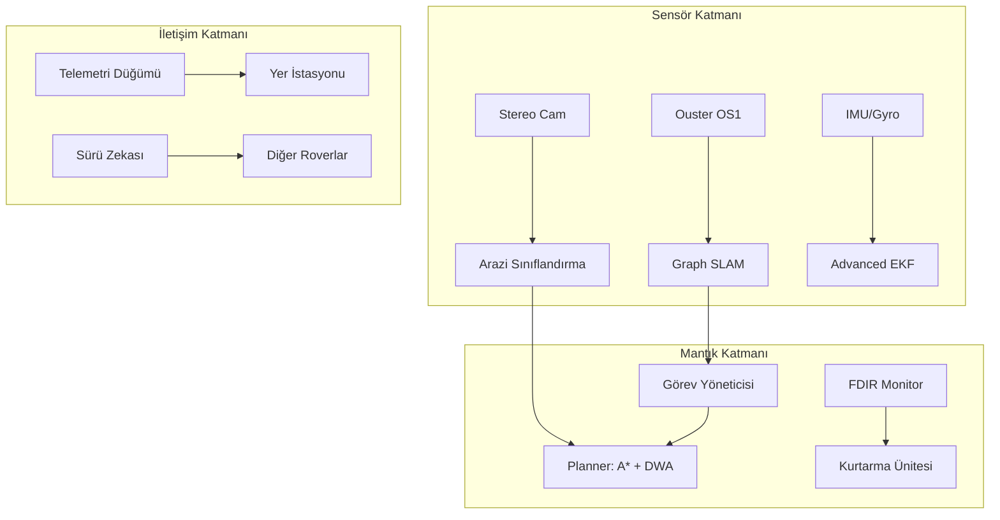

# 🌕 Ay-Otonom-Navigasyon: Commander-Class Ay Ekosistemi

## 🌟 Modern Ay Keşif Çerçevesi

**Ay-Otonom-Navigasyon**, güneş sistemimizin en zorlu ortamları için tasarlanmış, **Commander-Class** (Komutan Sınıfı) endüstriyel bir otonom navigasyon yığınıdır. TUA ve TEKNOFEST standartlarının ötesinde, gerçek bir Ay görevi operasyonu için gerekli olan **Gelişmiş Telemetri**, **Otonom Kurtarma Davranışları** ve **Enerji-Sürtünme Modelli Planlama** özelliklerini içerir.

---

## 📐 Matematiksel Operasyon Teorisi & Gelişmiş Ekler

### 1. Çok Kriterli Yol Planlama (Advanced A*)
A* algoritmamız, sadece mesafeyi değil, Ay yüzeyindeki sürtünme ($\mu$) ve güneş enerjisi potansiyelini ($E$) de optimize eder:
$$ J(n) = \sum_{i=start}^{goal} \frac{d(i, i+1) \cdot S(i) \cdot E(i)}{\mu(i)} $$
- **Sürtünme ($\mu$):** Kaya (1.2), Regolit (0.8), Krater Duvarı (0.6).
- **Enerji ($E$):** $1 / (I_{solar} + 0.1)$.

### 2. Durum Tahmini (EKF Matrix Form)
Rover konumu ($x, y, \theta$) ve hızı ($v, \omega$) şu matris formunda tahmin edilir:
$$ P_{k|k-1} = F_k P_{k-1|k-1} F_k^T + Q_k $$
Jakoben Matrisi ($F$):
$$ F = \begin{bmatrix} 1 & 0 & -v\Delta t \sin\theta \\ 0 & 1 & v\Delta t \cos\theta \\ 0 & 0 & 1 \end{bmatrix} $$

---

## 🏗️ Yazılım Mimarisi (Commander-Class)

### Düğüm (Node) Detayları
| Düğüm Adı | Görev | Yayın (Topic) |
| :--- | :--- | :--- |
| `perception_node` | LiDAR/Kamera işleme | `/hazard_map`, `/terrain_type` |
| `navigation_node` | A* Rota ve DWA Kontrol | `/cmd_vel`, `/planned_path` |
| `mission_manager` | FSM (IDLE/EXEC/RECOVERY) | `/mission_status` |
| `telemetry_node` | JSON Görev Verileri | `/mission_telemetry` |
| `fdir_node` | Watchdog / Sağlık İzleme | `/emergency_stop` |

---

## 🛡️ Otonom Kurtarma ve Güvenlik Protokolleri

Sistem, kritik arıza durumlarında şu prosedürleri otomatik olarak başlatır:
- **ShakeToClear:** Rover kumda patinaj yaparsa tekerlekleri zıt yönde titreterek kurtulur.
- **ThermalSafeDrift:** CPU sıcaklığı kritik eşiği geçerse otonom olarak gölgeye yönelir.
- **Heartbeat Timeout:** Herhangi bir düğüm 500ms'den fazla yanıt vermezse FDIR sistemi acil durdurma (E-STOP) yayınlar.

---

## 🌑 Görev Operasyon Senaryoları

### ⚡ Senaryo A: Shackleton PSR Su Araması
- **Zorluk:** Sıfır görünürlük, ekstrem eğim.
- **Çözüm:** LiDAR-only SLAM ve PSR-uyumlu enerji planlama.

### 🪐 Senaryo B: Çoklu Rover Sürü Keşfi
- **Zorluk:** Geniş alan haritalama, iletişim gecikmesi.
- **Çözüm:** `swarm_node` üzerinden merkezi olmayan harita birleştirme.

---

## 🔧 Sorun Giderme (Troubleshooting)

| Sorun | Olası Neden | çözüm |
| :--- | :--- | :--- |
| `ModuleNotFoundError` | Eksik bağımlılıklar | `pip install numpy scipy rclpy` |
| Rota Çizilemiyor | Engellerle çevrili hedef | Hedefi 1m uzağa taşıyın |
| Telemetri Gecikmesi | Yüksek CPU yükü | DWA çözünürlüğünü düşürün |

---

  <b>Geleceğin Ay Altyapısını Bugün İnşa Ediyoruz</b> 
  <i>Yunus-Arch Uzay Teknolojileri Ar-Ge Merkezi © 2026</i> 
  <i>"Per Aspera Ad Astra"</i>

