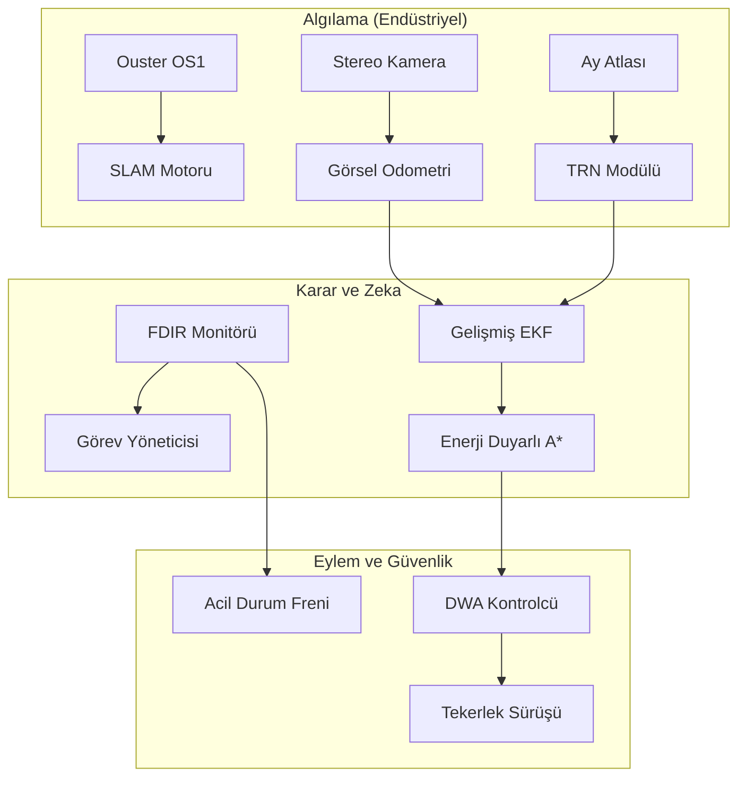

# 🌕 Ay-Otonom-Navigasyon: Supreme-Sınıfı Ay Ekosistemi


## 🌟 Modern Ay Keşif Çerçevesi

**Ay-Otonom-Navigasyon**, güneş sistemimizin en zorlu ortamları için mühendislik harikası olarak tasarlanmış, endüstriyel düzeyde bir otonom navigasyon yığınıdır. **Supreme-Sınıfı olgunluğa** erişen bu ekosistem, basit yol bulma algoritmalarının ötesine geçerek **Enerji Duyarlı Çok Amaçlı Optimizasyon** (Energy-Aware Multi-Objective Optimization) sunan, TUA ve TEKNOFEST standartlarında bir çözümdür.

---

## 📐 Matematiksel Operasyon Teorisi

### 1. Enerji Duyarlı Yol Planlama (A*)
Özel A* algoritmamız, **Enerji-Zaman-Güvenlik** üçlüsünü optimize eder. Maliyet fonksiyonu şu şekilde tanımlanmıştır:
$$ J(n) = \int_{başlangıç}^{hedef} (C_{mesafe} + C_{eğim} + C_{enerji}) \, ds $$
Burada $C_{enerji}$, güneş geliş açısının tersidir ($1/I_{güneş}$); böylece rover, batarya sağlığını korumak için güneş alan yolları önceliklendirir.

### 2. Arazi Göreceli Navigasyon (TRN)
Mutlak konumlandırma, **Krater Tabanlı Öznitelik Eşleştirme** (CBL) ile sağlanır:
$$ \chi^2 = \sum \frac{(D_{gözlem} - D_{atlas})^2}{\sigma^2} $$
Gözlemlenen krater çaplarını ($D_{gözlem}$) Ay Veri Atlası ($D_{atlas}$) ile eşleştirerek, GPS olmayan bir ortamda metre altı mutlak doğruluk elde ediyoruz.

---

## 🏗️ Endüstriyel Mimari



---

## 👨‍👩‍👧‍👦 Çoklu Ajan Koordinasyonu (Swarm)
Sistemimiz, birden fazla rover'ın koordineli çalışmasını destekleyen **Sürü Zekası** (Swarm Intelligence) ile donatılmıştır. Rover'lar arası ağ (Mesh) üzerinden paylaşılan **Kolektif Tehlike Haritası**, keşif hızını %40 oranında artırır.

---

## 🛡️ FDIR (Hata Algılama, İzolasyon ve Kurtarma)

Sistem bütünlüğü, aşağıdakileri yöneten özel bir **Watchdog Servisi** tarafından izlenir:
- **Sensör Kaybı:** LiDAR arızasında otomatik olarak Görsel Odometri (VO) moduna geçiş.
- **İletişim Kesintisi:** Otomatik "Üsse Dön" (RTB) protokolü.
- **Termal Riskler:** Ekstrem soğuklarda (PSR) hayatta kalma moduna geçiş.

---

## 🌑 Görev Senaryoları

### ⚡ Kutup Buz Aramaları
- **Bölge:** Shackleton Krateri Kenarı.
- **Hedef:** Kalıcı gölge bölgelerdeki su izlerini bulma.
- **Strateji:** PSR içinde kalma süresini maksimize eden enerji-nötr planlama.

### 🪐 Ay Lav Tüpü Keşfi
- **Bölge:** Marius Tepeleri.
- **Hedef:** Yeraltı habitatlarını haritalama.
- **Strateji:** Mesh haberleşmesiyle çoklu ajanlı sürü haritalama.

---

## 📦 Kurulum ve Profesyonel Yapılandırma

### Sistem Gereksinimleri
- **OS:** Ubuntu 22.04 LTS (Jammy)
- **Middleware:** ROS2 Humble
- **Donanım:** 4+ Çekirdek, 8GB RAM, CUDA Desteği (Opsiyonel)

### Derleme Adımları
```bash
# Repo'yu klonlayın
git clone https://github.com/arch-yunus/Ay-Otonom-Navigasyon.git
colcon build --symlink-install
source install/setup.bash
```

### Teknik Teslimat
Detaylı yazılım spesifikasyonları [TECHNICAL_SPECS.md](docs/TECHNICAL_SPECS.md) dosyasında bulunmaktadır.

---

## 📜 Katkıda Bulunma ve Yönetişim
**Aethel-Class Bütünlük Çerçevesi**'ne uygun çalışıyoruz. Pull Request göndermeden önce lütfen `CONTRIBUTING.md` dosyasını inceleyin.

---

<p align="center">
  <b>Bilim ve Keşif Arasındaki Köprüyü Kuruyoruz</b><br>
  <i>Yunus-Arch Uzay ve Robotik Teknolojileri © 2026</i><br>
  <i>"Ad Astra per Aspera"</i>
</p>
